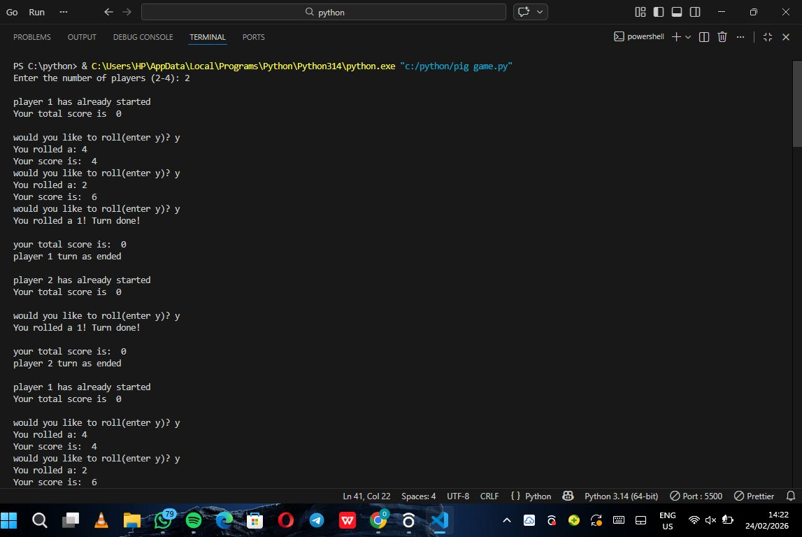

# PIG GAME PROJECT

### DESCRIPTION

    This project is used to allow players to roll a dice and when they reach a certain score they win but uf they roll a one there score drops back to zero

### Steps taken to develop the project

---

1. First step is to import random so as to get random numbers.To do this we use:  
   `import random`
2. Second step is to derive a function to roll the dice and show random numbers between 1-6. To do this we use:
   ```python
   def roll():
       min_value = 1
       max_value = 6
       roll = random.randint(min_value, max_value)
       return roll
   ```
3. Third step is to define the amount of players that can play the game. To do that we will use:  
   `players = input("Enter the number of players (2-4): ")`
4. Fourth step is to check if the variables contains only numbers. To do this we use:  
   `if players.isdigit():`
5. Fifth step is to create a function that will not allow you to input more that the required number of people to play the game and the max is 4 and min is 5. To do this we use:
   ```python
       players = int(players)
       if 2 <= players <= 4:
           break
       else:
           print("Must be between 2-4 players")
   ```
6. Sixth step is to put the function from step 5 into step 4 this is to ensure that the number of players to play the game will be a digit and if the user insert another variable that is not a digit it will let the user know that it is invalid.
   ```python
       if players.isdigit():
           players = int(players)
           if 2 <= players <= 4:
               break
           else:
               print("Must be between 2-4 players")
       else:
           print("Invalid, try again.")
   ```
7. Seventh step is to put it in a while loop so it will keep on asking the user till the user gets its right and move on to the next step.

   ```python
       while True:
           players = input("Enter the number of players (2-4): ")
           if players.isdigit():
               players = int(players)
               if 2 <= players <= 4:
                   break
               else:
                   print("Must be between 2-4 players")
           else:
               print("Invalid, try again.")
   ```

8. eight step is to define the score system. To do this we use:

   ```python
       max_score = 50
       player_scores = [0 for _ in range(players)]
   ```

9. The next step is to initiate for all players by putting it in a for loop to interact with each players using ther player index.
   ```python
    for player_indx in range(players):
   ```
10. This is the next stage where we write out what we want the use to see next and also set a current score to be zero.

    ```python
    print("\nplayer", player_indx + 1, "has already started")
    print("Your total score is ", player_scores[player_indx], "\n")
    current_score = 0
    ```

11. The next step is to create an input asking the user if they would like to roll.  
    `should_roll = input("would you like to roll(enter y)? ")`

12. This is the next step where if the user wants to continue it will initiate the roll fuction and give them random numbers if not it will breakout of the if statement.

    ```python
         if should_roll.lower() == "y":
            value = roll()
        else:
            break
    ```

13. The next step is to create a condition where if you roll 1 your score should return back to zero.
    ```python
        if value == 1:
            print("You rolled a 1! Turn done!")
            current_score = 0
            break
    ```
14. Then create an else statement to keep on adding the current score plus the score gotten when rolled as long as it is not 1.
    ```python
        if value == 1:
            print("You rolled a 1! Turn done!")
            current_score = 0
            break
        else:
            current_score += value
            print("You rolled a:", value)
        print("Your score is: ", current_score)
    ```
15. the next stage is to keep everything in a while loop to no stop until one of the players reaches gets the max_score then the person is the winner of the game.

    ```py
    while max(player_scores) < max_score:
        for player_indx in range(players):
            print("\nplayer", player_indx + 1, "has already started")
            print("Your total score is ", player_scores[player_indx], "\n")
            current_score = 0
            while True:
                should_roll = input("would you like to roll(enter y)? ")
                if should_roll.lower() == "y":
                    value = roll()
                else:
                    break
                if value == 1:
                    print("You rolled a 1! Turn done!")
                    current_score = 0
                    break
                else:
                    current_score += value
                    print("You rolled a:", value)
                print("Your score is: ", current_score)
            player_scores[player_indx] += current_score
            print("\nyour total score is: ", player_scores[player_indx])
            print("player", player_indx + 1, "turn as ended")

    max_score = max(player_scores)
    winning_indx = player_scores.index(max_score)
    print("\nplayer", winning_indx + 1, "is the winner with a score ", max_score)
    ```

## OUTCOME EXECUTION




